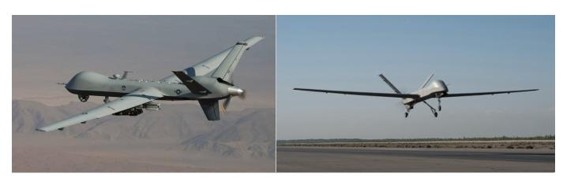
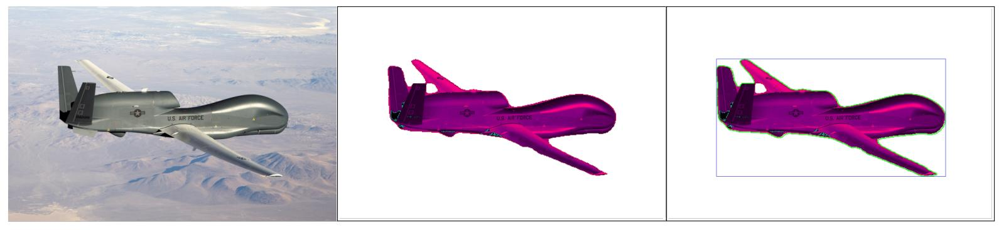
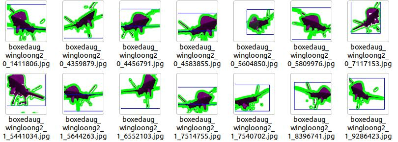
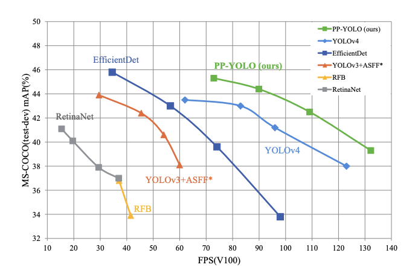
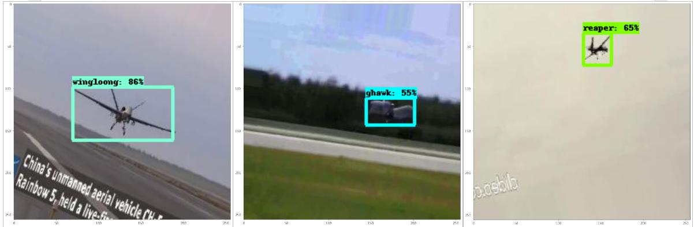

  

# Drone Object Detection and Classification

## Table of Contents

* [General Information](#General-Information)
    * [Building Training Set](#Building-Training-Set)
    * [Transfer Learning Model: EfficientDet](#Transfer-Learning-Model:-EfficientDet)
    * [Final Results](#Final-Results)
    * [Tools Used](#Tools-Used)
    * [Tools Used](#Tools-Used)
    * [Future Improvements](#Future-Improvements)

## General Information
As militaries move closer to utilizing drones for wider mission sets it is logical to assume the drone population will continue to expand. With more drones in the air it will be more critical to identify the drone type and country of origin, using everyday digital cameras. In order to create a machine learning model to assist in drone detection and classification there must be a very large dataset to train from. This highlights two issues when building that dataset:

1. Some fixed wing military drones look very similar, even to the human eye, at farther distances, making it difficult to create accurate training datasets using only open source images.
2. The amount of open source images are limited and usually only include images of the drone parked on the runway, contrary to the airborne aspect needed for the actual use case. 

In order to overcome these challenges we will utilize the power of a pretrained segmentation model, OpenCV, and Transfer Learning.

### The project files are organized as follows:

- find_box.py: Python file used to break down video into frames, augment the images, create bounding boxes, and split the verified images into subsequent folders. 
- generate_allrecords.py: Python file used to create CSV and TFRecord files for model training.
- EfficientDet_Drones.ipynb: Model training and evaluation file.
- images: Folder containing images used in the README file.
- src: Folder containing a blank Pascal VOC file, object detection pbtxt file, and two other python files with all the functions used in this project.
- drones: Folder that includes sample data including images, Pascal VOC files, CSV files, and TFRecords.

### Resources:

* Roboflow (https://blog.roboflow.com/pp-yolo-beats-yolov4-object-detection/)
* Raccoon Github (https://github.com/datitran/raccoon_dataset)
* Countour/Bounding Box (https://www.youtube.com/watch?v=WQeoO7MI0Bs)
* Pixellib (https://pixellib.readthedocs.io/en/latest/change_image_bg.html)
_______________________________________________
## Building Training Set:

A quick Google search highlights the first issue with building a training set: Searching for a Chinese 'CH-5 drone' provides many pictures of fixed wing drones but it is not immediately evident if all the images searched are in fact a 'CH-5 Drone'. Two results from that search, shown below, demonstrate the difficulty in accurately classifying the results. The drone on the left is a Reaper drone, built by the United States, while the drone on the right is a CH-5, built by China. Without the US Military marking on the back of the drone in the picture on the left it would be very difficult to accurately classify it. Misclassifying images in the training set would certainly spell disaster for the final models precision, recall, and accuracy. 

  

The next option is to find video clips of specific drones and break the video down into frames for training, validation and testing. This method was much more reliable for label accuracy and provided a larger set of images to work with. The following number of frames were taken from open source Youtube Videos:

* Global Hawk (USA) -  1396 Frames
* Reaper (USA) - 1087 Frames
* Wing Loong (CHA) - 606 Frames

One advantage of object detecting when it comes to flying drones is that most of the time the drone will be the only object within the frame, making it ideal for using a segmentation model (Pixellib: https://pixellib.readthedocs.io/en/latest/change_image_bg.html) to identify the aircraft and then drawing a contour around the image. This will allow for a bounding box to be drawn around the largest contour in the image, which most of the time is the drone. The image below shows the original image on the left followed by a segmented image of the drone in the middle and a final image on the left which includes the contour line and bounding box. 

  

We will then use image augmentation to rotate, shear, flip, and zoom the images so we are able to get over 15,000 images of each drone. 

* Global Hawk (USA) -  19,814 Training Frames
* Reaper (USA) - 15,244 Training Frames
* Wing Loong (CHA) - 17,564 Training Frames

Because the segmentation model does not always detect the aircraft and some of the videos do not always show the drone, we must browse the bounded images to ensure all the images contain the drone for correct classification. The image below shows the segmented images a human would have to scroll through in order to verify there is in fact a bounding box and that the drone is fully ensconced within the bounding box.

  

By implementing our own bounding boxes we are able to utilize those coordinates to create individual Pascal VOC files for each image and subsequently create CSV and TFRecord files for use in the Transfer Learning of EffecientDet. 

____________________________________________________________

## Transfer Learning Model: EfficientDet

EfficientDet is an object detection model created by the Google brain team, achieving the highest accuracy with fewest training epochs in object detection tasks. It is an advanced version of EfficientNet, which was the state of art object classification model in early 2019. This problem set requires accurate object detection using standard video cameras, which provide video feeds with approximately 30 frames per second (FPS). The diagram below shows that 'Efficientdet_D0' will provide the best Mean Average Precision (mAP) at video feeds with 30 FPS.

  

With help from the customized EfficientDet model structure built by RoboFlow (https://blog.roboflow.com/train-a-tensorflow2-object-detection-model/) we are able to feed in our own dataset and obtain impressive results. 
_________________________________________________________

## Final Results

After 30,000 training steps the mean average precision (mAP) scores are shown below, along with examples of True Positives from the testing set: 

* mAP: 0.587327
* mAP at 0.50 IOU: 0.932432
* mAP at 0.75 IOU: 0.640563

  

_______________________________________

## Tools Used

***Python:***

Data Analysis: Google Colab, TensorFlow, Pandas, Scikit-Learn 

***Visualization:***

Data Visualization: Tensorboard

_______________________________________
## Future Improvements

1. Translate the training dataset to COCO format and determine model results from Yolov5 for comparison to EfficientDet.
2. Run model on drone video to see the real time results of the model.

