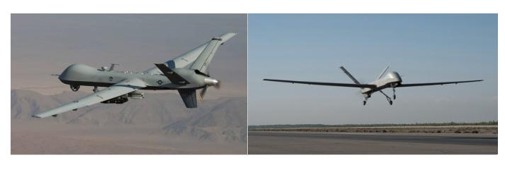
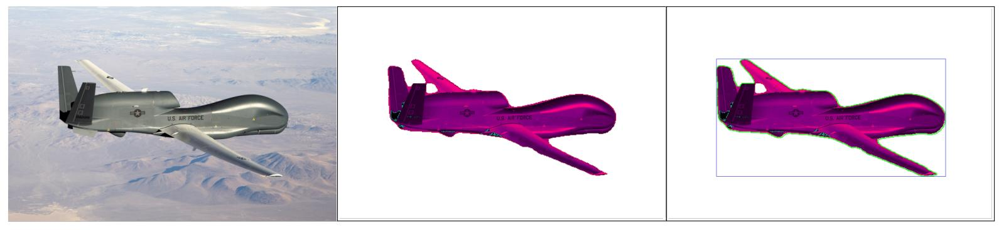

  

# Drone Object Detection and Classification

## Table of Contents

* [General Information](#General-Information)
    * [Exploratory Data Analysis](#Exploratory-Data-Analysis)
    * [Building Training Set](#Buidling-Training-Set)
    * [Final Results](#Final-Results)
    * [Tools Used](#Tools-Used)
    * [Future Improvements](#Future-Improvements)

## General Information
As the worlds militaries move closer to utilizing drones for wider mission sets, with zero risk to human operators, it is logical to assume those drones will be inclinded to fly deeper into higher risk engagement zones. When this happens it will become more and more difficult to identify the drone type and country of origin. In order to create a machine learning model to assist in drone detection and classification there must be a very large dataset to train from. This highlights two issues when building a dataset:

1. Some fixed wing military drones look very similar, even to the human eye, at farther distances making it difficult to create accurate training datasets using only open source images.
2. The amount of open source images is very limited and usually only include images of the drone parked on the runway, contrary to the airborne aspect needed for training. 

In order to overcome these challenges we will utilize the power of a pretrained segmentation model, OpenCV, and Transfer Learning.
_______________________________________________
## Exploratory Data Analysis:

A quick Google search highlights the first issue with building a training set. Searching for a Chinese 'CH-5 drone' provides many pictures of fixed wing drones but it is not immediately evident if all the images searched are in fact a 'CH-5 Drone'. The two results from that search, shown below, demonstrate the difficultly accurately classifying the results. The drone on the left is a Reaper drone, built by the United States, while the drone on the right is a CH-5, built by China. Without the US Military marking on the back of the drone in the picture on the left it would be very difficult to accurately classify it. Misclassifying images in the training set would certainly spell disaster for the final models precision, recall, and accuracy. 

  

The next option is to find video clips of specific drones and break the video down into frames for training. This method was much more reliable for label accuracy and provided a larger set of images to work with:

Global Hawk (USA) -  1396 Frames
Reaper (USA) - 300 + 787 Frames
Wing Loong (CHA) - 180 + 315 + ____ Frames

One advantage of object detecting when it comes to flying drones is that most of the time the drone will be the only object within the frame, making it ideal for using a segmentation model (Pixellib) to identify the aircraft and then drawing a contour around the image. This will allow for a bounding box to be drawn around the largest contour in the image, which most of the time is the drone. Below shows the original image on the left followed by a segmented image of the drone in the middle and a final image on the left which includes the contour line and bounding box. 

  

### The project files are organized as follows:

- EDA.ipynb: File used to scrape, explore, and transform the data for modeling
- NLP.ipynb: File used for supervised learning models
- images: All images used in the README.md file
- src: Contains a python file with all the functions used in this project
- data: Includes sample '.csv' data to run the EDA & NLP files

### Articles used for help:

* Text Classification with XLNet in Action: https://medium.com/@yingbiao/text-classification-with-xlnet-in-action-869029246f7e
* Scraping Medium with Python & Beautiful Soup: https://medium.com/the-innovation/scraping-medium-with-python-beautiful-soup-3314f898bbf5
____________________________________________________________

## Supervised Learning Models:

***Step 1: Establish Training and Testing Data***

The training and testing data was compiled from articles between 2018 to 2020 and split into a data set containing the top and bottom 35% of articles based on the number of 'claps' they received. Examples from the popular and unpopular article titles are seen below:

  

***Step 2: Classification on Article Titles***

A list of classification models were used on the popular/unpopular article titles from the data set including: Decision Tree, Random Forest, KNN, XGBClassifier, and Gradient Boosting Classifier. The figure below shows how poorly these models did using only the article titles. The best model was the Random Forrest Classifier with an F-1 score of 0.66.

  

***Step 3: Regression on Article Titles***

Due to the inaccuracies from the classification results the decision was made to run a list of regression models on article titles from the entire data set using the number of 'claps' as the target data. The results below do not show much improvement from the baseline model with an RMSE of 1907. The best model in comparison is the Ridge Regression with an RMSE of 1886.

  

***Step 4: Classification on Full Article Text***

In order to improve accuracy the full article text was used with the same classification labels used in Step 2. The results improved slightly with the Gradient Boosting Classifier achieving an F-1 score of 0.72.

  

***Step 5: Resgression on Full Article Text***

Finally, the same full article text was used with the same regression information from Step 3. The results are shown below with none of the models doing better than the baseline model RMSE of 1907.

  

__________________________________________________________

## Final Results

The final results from the supervised models shows that the Gradient Boosting Model, used on full article text, demonstrates the best results when to predict the popularity of an article.

  

 The confusion matrix for the Gradient Boosting Model is shown below. Please note that 1 indicates a popular article and 0 indicated an unpopular one.

  

_______________________________________

## Tools Used

***Python:***

Data Gathering: Pandas 
Data Analysis: Google Colab, Tensor Flow, Pandas, Scikit-Learn, NLTK 

***Visualization:***

Data Visualization: Matplotlib

_______________________________________
## Future Improvements

1. Increase accuracy of the models by running more full text articles through the models.
2. Scrape more articles from other websites.
